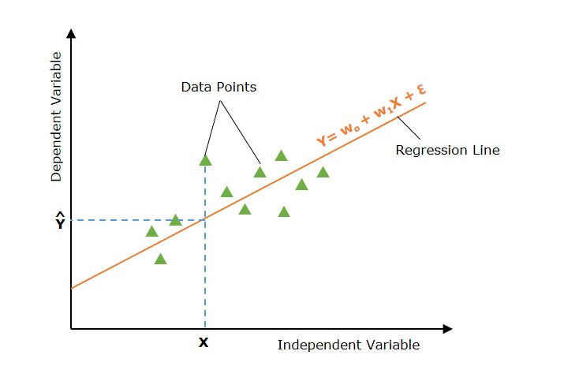
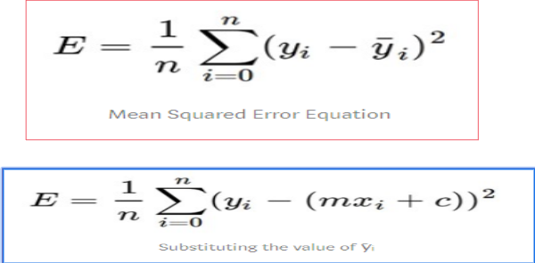
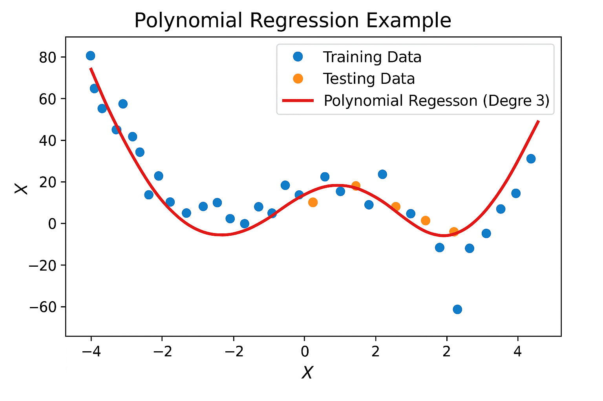

## Linear Regression
---
is a prominent statistical method and machine learning algorithm used to find the linear relationship between a target (dependent) variable and one or more predictor variables. 

It maps numeric inputs to numeric outputs by fitting a line to a set of data points.

The core objective of linear regression is to obtain a "best fit line".

- **There 2 types of LR**  `simple & multiple`:  
- **Simple LR:** has only one `x` (1 Predictor Vairiable) & the target Variable (Predicted Variable).  
- **Multiple LR:** 2 or more predictor variables & the target variable.

- **Examples:**

When we predict rent based on square feet alone that is simple linear regression. `[Simple]`  
When we predict rent based on square feet and age of the building that is an example of multiple linear regression. `[Multiple]`

---

The best fit line is the one where the total prediction error measured as the distance between the actual data points and the regression line is as small as possible.

To achieve this, the model uses a loss function.

---

## Simple LR
---
**yp = m * x + c**

m & c are changed to minimize the error (control the position of the line)

---
**Sum of Squared Error:**

This calculates the total squared distance between the true data points and the regression line: 
Error = SUM[(actual_output - predicted_output)2]

**Mean Squared Error (MSE):**

This is the specific loss function used to evaluate the accuracy of the chosen `m` and `c` values  

---

### Gradient descent
---

Gradient descent is an iterative optimization algorithm to find the minimum of a function (Minimizing the Error).

### Multiple LR:

Multiple regression considers the influence of multiple independent variables on a dependent variable `Y`.

yp = b0 + b1 * x1 + b2 * x2 + ... + bn * xn

- **b0** is `c`
- **bn** is `m`

**Multiple regression analysis has three main uses:-**
1. You can look at the strength of the effect of the independent variables on the dependent variable.
2. You can use it to ask how much the dependent variable will change if the independent variables are changed.
3. You can also use it to predict trends and future values.

---

## Polynomial Regression:
---

Change in the degree of input value to make the line more fit the data.

`More Fit the Data Means:` passes through more data points.

---

**What is overfitting?**

Overfitting is a common problem in machine learning and data science where a model fails to generalize well from its training data to new, unseen data.

**When does overfitting happen?** 

It typically happens when a model is overly complex, such as when you drastically increase the degree in polynomial regression (for example, using a degree of 20).  
This high degree forces the regression curve to bend sharply to pass through almost all of the specific data points in your training set.

**noise:** refers to the random points, fluctuations, or extreme outliers in your training data that do not represent the actual relationship you are trying to predict.

---